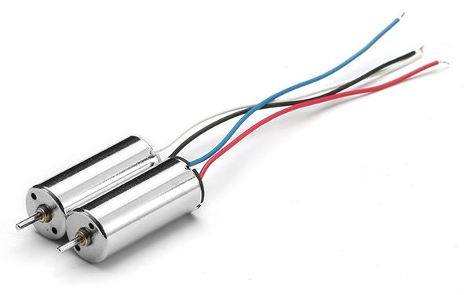
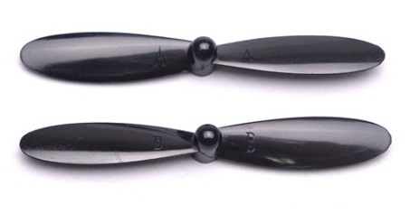
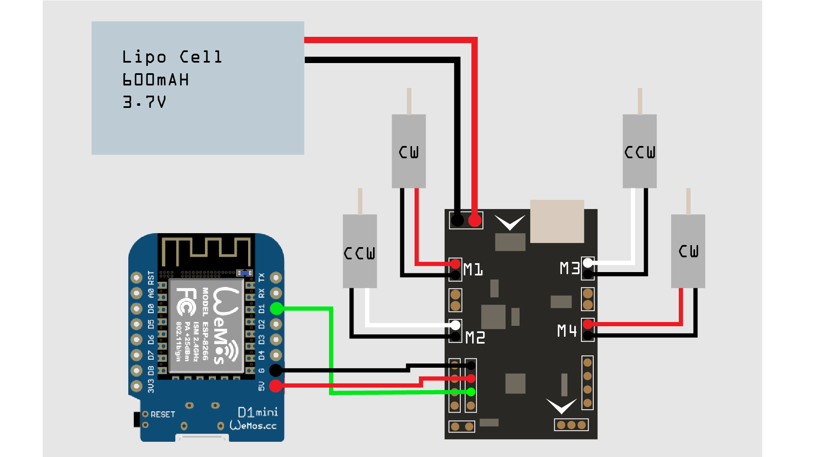
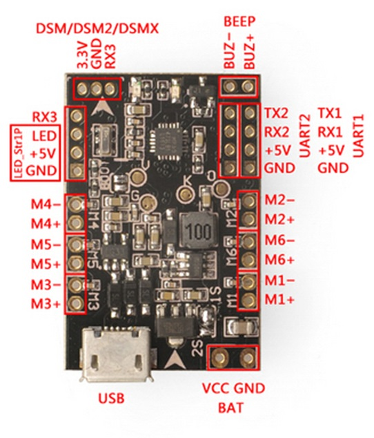
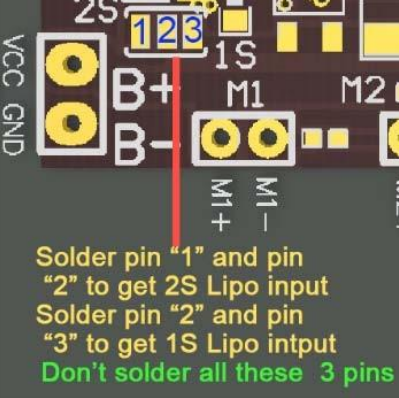

# Firefly Build 1
Here is the detailed construction process of the first successful build of project Firefly:

## Contents

- [Materials](#materials)
- [Circuit Connections](#circuit-connections)
- [Flight Controller Configuration](#flight-controller-configuration)
- [ESP8266 Configuration](#esp8266-configuration)
- [Finalizing Setup](#finalizing-setup)

## Materials

- 90mm carbon fibre quadcopter frame (Any frame supporting **8520 motors** should work)
- 8520 Coreless motors 2 pairs (cw motor has **red+black/blue** wire, ccw motor has **white+black** wire)
- 55mm Propeller 2 pairs (Clockwise + Counterclockwise)
- F3 Evo Brushed Flight Controller (Any **brushed** flight controller should do)
- 600mAH 1S 3.7V lipo cell
- WeMos D1 mini ESP8266 WiFi Module (Any ESP8266 should work)

<figure align="center">
    
    <figcaption>Frame</figcaption>
</figure>

<figure align="center">
    
    <figcaption>Motor</figcaption>
</figure>

<figure align="center">
    
    <figcaption>Propeller</figcaption>
</figure>

<figure align="center">
    
    <figcaption>Flight Controller</figcaption>
</figure>

<figure align="center">
    
    <figcaption>Lipo Cell</figcaption>
</figure>

<figure align="center">
    
    <figcaption>Wifi Module</figcaption>
</figure>


## Circuit Connections

<figure align="center">
    
    <figcaption>Overall Circuit Diagram</figcaption>
</figure>

<figure align="center">
    
    <figcaption>Flight Controller pinout diagram</figcaption>
</figure>

### Step 1: Connecting Battery Connector to Flight Controller
Watch for the polarity of the battery connector cable while connecting it to the power pins of the flight controller. A reverse battery connection can fry your controller. If you are using a 1S battery, make sure the 1S jumper is soldered together as the flight controller supports both 1S and 2S power supplies in separate modes (The connection pads are near the battery connector)

<figure align="center">
    
    <figcaption>Voltage Selection Jumper</figcaption>
</figure>
<figure align="center">
    
    <figcaption>Voltage Selection Jumper</figcaption>
</figure>

### Step 2: Connecting Motors to Flight Controller
Red+Blue or Red+Black motors are designed to rotate clockwise (along with a clockwise propeller) and White+Black motors are designed for counter-clockwise rotation. For all motors, **Black means Negative** and the other colored wire is positive. F3 Evo brushed flight controller has 6 motor connections available (4 in some variants). We will connect clockwise motors (Red+Black) on connections M1, M4 and counter-clockwise motors (White+Black) on M2, M3. Watch out for the polarity of the connections, you can find them on the pinout diagram of the flight controller.

If you happen to have four motors of the same type (clockwise), then you can just flip the connections for two of the motors to get reverse rotation, althought this is generally not recommended since these tiny brushed motors are usually coiled to efficiently run in one direction. Reversing the polarity makes the motor die out faster than expected lifetime of about 7 hours of 100 flights.

### Step 3: Connecting WeMos D1 mini to Flight Controller
F3 evo brushed flight controller has 3 UART ports, you can find the details on the <a href="https://www.unmannedtech.co.uk/uploads/6/7/0/2/6702064/f3_evo_fc_manual.pdf">user manual</a>

| Serial Port   | Used For      |
| ------------- |:-------------:|
| UART1 | GPS/OSD |
| UART2 | PPM/SBUS receiver input |
| UART3 | GPS/Telemetry module |

We will be using **UART2** as the ESP8266 module will be used as a PPM receiver over WiFi.

<figure align="center">
    
    <figcaption>WeMos D1 Mini Pinout</figcaption>
</figure>

The code has been configured to be using GPIO5 pin on the ESP8266 module as the PPM output, which is pin D1 on WeMos D1 mini.

| Flight Controller | ESP8266 pin | WeMos D1 Mini |
| ------------- |:-------------:|:-------------:|
| UART2 RX | GPIO5 | D1 |
| UART2 V+| +5V input | +5V input |
| UART2 GND | GND | GND |

In this manner, the flight controller will power the ESP8266 module when connected to USB/Battery.

## ESP8266 Configuration

### Step 1: Setting up Arduino IDE
ESP8266 module can be easily programmed from the widely used Arduino IDE.

- Download and install the latest <a href="https://www.arduino.cc/en/main/software">Arduino IDE</a>

- We will need to install dependencies for ESP8266 modules in the IDE. In the Arduino IDE, go to **Files > Preferences**. Here in the **Additional Board Manager URLs** field, paste the following line and click **ok**
    ```
    https://arduino.esp8266.com/stable/package_esp8266com_index.json
    ```
    Now go to **Tools > Board > Boards Manager**. The new boards index will load. Type ESP8266 in the search bar, and the ESP8266 library should show up. Install it. (Sometimes the url link does not work correctly, you might need to find alternate links to the library.)

    For more details, go to the <a href="https://github.com/esp8266/Arduino">ESP8266 github page</a>

### Step 2: Setting up drivers

WeMos D1 mini module uses the CH340 usb to serial driver IC for programming the onboard microcontroller unit. Windows by default does not recognize this, so you will need to install the driver from <a href="CH34x_Install_Windows_v3_4.EXE">here</a>.

After the driver has been installed, connect the ESP8266 module to the computer, and from Arduino IDE, it should be available under **Tools > Port**

### Step 3: Installing websockets library

The WiFi PPM code uses the esp websockets library.
- Download the <a href="arduinoWebSockets.zip">zip file</a>
- From a blank Arduino sketch, go to **Sketch > Include Library > Include .ZIP Library** and from there, select the downloaded zip file. The library will be imported in the IDE.

### Step 4: Uploading the Sketch

The WiFi inerface of the quadcopter uses WebSockets protocol for communicating using a browser window.

- The sketch used in this build is originally copied from another <a href="https://github.com/DipanshuShukla/ESP-PPM">github repo</a>. Download the entire <a href="ESP_PPM">sketch folder</a> and open the ESP_PPM.ino file from Arduino IDE. You should be able to upload the original sketch to the ESP Board without problem.

- After uploading, from your smartphone, you will find the hotspot on your phone WiFi. Connect to the hotspot and from smartphone browser, go to url 192.168.4.1

- The browser window will load a page with two joysticks. These are used to send control commands to the quadcopter.

- A joystick can be connected with the computer to send controls to the ESP8266 module too using firefox browser from PC.

## Flight Controller Configuration


## Finalizing Setup


## References
- <a href="https://www.instructables.com/id/Build-a-WiFi-Enabled-Micro-quadrotor/">WiFi enabled micro quadrotor</a>
- <a href="https://www.instructables.com/id/Long-Range-Wifi-PPM-MSP/">Long Range WiFi PPM instructables</a>
- <a href="https://community.micro-motor-warehouse.com/t/banggood-eachine-sp-racing-f3-evo-based-brushed-fc-set-up-guide-for-spektrum-sat-receivers/2574">F3 Evo setup guide</a>
- <a href="https://blog.dronetrest.com/setting-up-flight-modes-in-cleanflight-betaflight/">Betaflight flight modes</a>