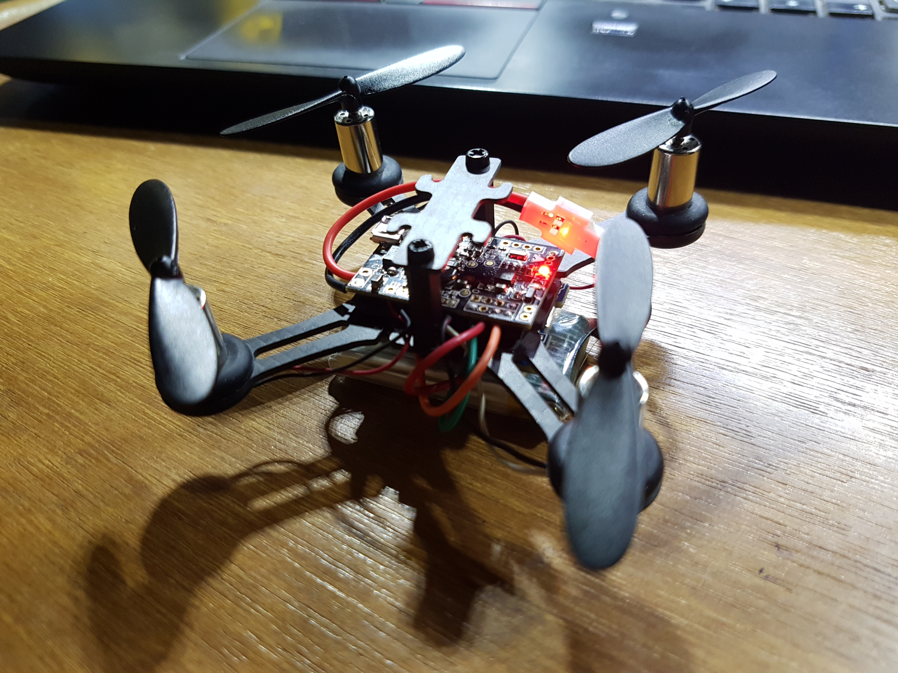

# Firefly
Micro quadcopter project (Under Development)

The objective of this project is to build an ultra low cost quadcopter platform for swarm of drones. (Inspired by <a href="https://espcopter.com/">ESP-Copter</a>, <a href="https://www.dronaaviation.com/product/">Pluto Drone</a>, <a href="https://www.ryzerobotics.com/tello">Ryze Tello</a>)

## Table of Contents

- [Build-1](#build-1)
- [TODO List](#todo-list)

## Build-1

The first build of the nano quad uses a 
- 90mm carbon fiber quadrotor frame
- 8520 coreless brushed motors
- 55mm propellers
- 600maH 1S Lipo cell
- WeMos D1 mini module as PPM receiver <a href="https://github.com/DipanshuShukla/ESP-PPM">(ESP-PPM)</a>
- SPRACING F3 EVO brushed flight controller

The reason behind using a ESP module instead of traditional RX modules is that ESP modules are easily programmable with the Arduino IDE, and ESP supports mesh networks which might be useful for swarming. The control interface is a web socket server that can be used from a smartphone browser with touch controls or firefox browser on PC with a traditional Gamepad. 

<figure align="center">
    
    <figcaption>Build 1</figcaption>
</figure>

Successful flight was achieved on September 2, 2020. For details on the build process, head on to the <a href="Build 1 - WiFi Quadcopter/README.md">Build-1 page</a>

## TODO List
- Port ESP8266 code to ESP32 (Build 1)
- Parameter Tuning (Build 1)
- Enable telemetry (Telemetry Test)
    - https://shipow.github.io/cleanflight-web/docs/telemetry.html
    - https://quadmeup.com/wifi-telemetry-for-cleanflight-with-ez-gui-and-esp8266/
    - https://diydrones.com/profiles/blogs/easy-to-use-frsky-library-for-arduino
    - https://github.com/sgofferj/arduino-frsky
    - https://ardupilot.org/copter/docs/common-frsky-telemetry.html
    - http://ceptimus.co.uk/?p=307
    - https://github.com/betaflight/betaflight/issues/6085
- Customizing Firmware
    - https://github.com/betaflight/betaflight/blob/master/docs/Customized%20Version.md
    - https://www.youtube.com/watch?v=37CP43OogQI
    - https://eecs.blog/compiling-betaflight-cleanflight-firmware-for-your-multirotor/
    - https://eecs.blog/adding-gps-back-to-cleanflight-for-f3-flight-controllers/
    - https://github.com/betaflight/betaflight/wiki/Betaflight-resource-remapping
    - https://www.reddit.com/r/Multicopter/comments/5rtcmn/adding_a_led_beeper_to_the_eachine_brushed_sp/
- Optical Flow Stabilization
    - https://robotzero.one/esp32-camera-module/
    - https://opencv-python-tutroals.readthedocs.io/en/latest/py_tutorials/py_video/py_lucas_kanade/py_lucas_kanade.html
    - https://robotics.stackexchange.com/questions/1844/stabilizing-a-quadcopter-with-optical-flow
- ESP Flight Controller 
    - https://github.com/rtlopez/esp-fc
    - https://github.com/PepeTheFroggie/EspCopter32
    - https://www.youtube.com/playlist?list=PLoPtpxJIxgnYnPrOeGHs3rdhhPgNGIYN5
- Other Tasks
    - https://dronerush.com/drone-gps-10778/
    - https://stackoverflow.com/questions/11217674/how-to-calculate-distance-from-wifi-router-using-signal-strength
    - https://www.kalmanfilter.net/background.html